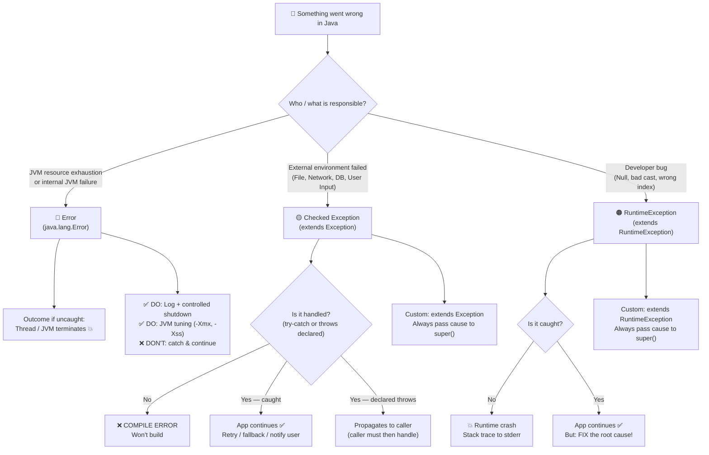

```
tags: java, exceptions, core-java, interview, 
type: permanent-note
status: complete
```

---
## 📌 Table of Contents

- [[#🧠 The Master Mental Model — Three Parties Framework]]
- [[#📦 Complete Hierarchy with Packages]]
- [[#🔍 Checked vs. Unchecked — The Core Philosophy]]
- [[#🏷️ The Naming Problem — Better Vocabulary]]
- [[#⚙️ How the Java Compiler Evaluates Exceptions]]
- [[#🔧 Custom Exceptions — Complete Guide]]
- [[#💀 What Does "Non-Recoverable" Really Mean?]]
- [[#🔄 Complementary Design Architecture]]
- [[#❓ The Right Question to Ask — Decision Framework]]
- [[#📊 Grand Comprehensive Schematic]]
- [[#🎯 Interview Dimensions — 6 YoE Candidate]]
- [[#⚡ Patterns & Anti-Patterns Quick Reference]]

---
## 🧠 The Master Mental Model — Three Parties Framework

> [!TIP] Core Intuition
> Stop memorizing. Instead, internalize this: **every Java program involves three parties, and when something goes wrong, the exception type tells you WHO failed.**

Think of a running Java application as a three-party conversation:

| Party               | Role                                            | When it fails → Java Type |
| ------------------- | ----------------------------------------------- | ------------------------- |
| **The Environment** | OS, Network, File System, DB, External Services | `Checked Exception`       |
| **Your Code**       | Developer-written business logic                | `RuntimeException`        |
| **The JVM**         | The execution engine running your code          | `Error`                   |
### Deriving the Hierarchy From First Principles (No Memorization Needed)

Ask yourself: *"What can go wrong while running a Java program?"*

```
Q1: Did the JVM itself run out of resources or hit an internal failure?
    → Error  (OutOfMemoryError, StackOverflowError)

Q2: Did the external world fail?  
    (File missing, DB down, network unreachable, bad user input format)
    → Checked Exception  (IOException, SQLException, ParseException)

Q3: Did MY code have a bug?
    (Null dereference, wrong array index, invalid cast)
    → RuntimeException  (NullPointerException, ClassCastException)
```

> [!IMPORTANT] The Design Intent of James Gosling
> Java was designed with the philosophy: **"External unreliability should be contractually acknowledged."** 
> If you call a method that talks to a file or network, the compiler forces you to acknowledge: *"Yes, I know the world is unreliable and I have a plan."* 
> But if YOU wrote a bug, no external force can save you — the compiler forcing a try-catch wouldn't help; you just need to fix the code.

---
## 📦 Complete Hierarchy with Packages

### Package Quick-Map

```
java.lang    → Throwable, Error, Exception, RuntimeException
               OutOfMemoryError, StackOverflowError, AssertionError
               NullPointerException, IllegalArgumentException, IllegalStateException
               ArithmeticException, ClassCastException, IndexOutOfBoundsException
               CloneNotSupportedException, InterruptedException
               ReflectiveOperationException + its children (Java 7+)

java.io      → IOException, FileNotFoundException, EOFException, ObjectStreamException

java.net     → SocketException, ConnectException, MalformedURLException, UnknownHostException

java.sql     → SQLException, BatchUpdateException, SQLTimeoutException

java.util    → ConcurrentModificationException, NoSuchElementException,
               InputMismatchException, EmptyStackException  ← ALL unchecked

java.text    → ParseException  ← checked

javax.xml    → ParserConfigurationException, SAXException  ← checked
```
### The Complete Annotated Tree

```
java.lang.Object
│
└── java.lang.Throwable                        [java.lang]
    │   Core API: getMessage(), getCause(), printStackTrace()
    │             addSuppressed(), getSuppressed(), initCause()
    │             fillInStackTrace()  ← native; captures call stack at throw time
    │
    ├─═════════════════════════════════════════════════════════════╗
    │  java.lang.Error                         [java.lang]         ║ UNCHECKED
    │  ══════════════════════════════════════════════════          ║ JVM-Level
    │  "The JVM engine itself is broken"                           ║
    │                                                              ║
    │  ├── java.lang.VirtualMachineError                           ║
    │  │   ├── java.lang.OutOfMemoryError   ← heap exhausted       ║
    │  │   ├── java.lang.StackOverflowError ← call stack full      ║
    │  │   └── java.lang.InternalError      ← JVM internal failure ║
    │  │                                                           ║
    │  ├── java.lang.AssertionError          ← assert keyword fail ║
    │  ├── java.lang.ThreadDeath             ← Thread.stop() [dep] ║
    │  │                                                           ║
    │  ├── java.lang.LinkageError            ← class loading broke ║
    │  │   ├── java.lang.NoClassDefFoundError  ← JAR missing       ║
    │  │   ├── java.lang.ClassCircularityError                     ║
    │  │   ├── java.lang.VerifyError           ← bad bytecode      ║
    │  │   └── java.lang.UnsatisfiedLinkError  ← native lib miss   ║
    │  │                                                           ║
    │  └── java.awt.AWTError                  [java.awt]           ║
    │  ══════════════════════════════════════════════════          ║
    ╚══════════════════════════════════════════════════════════════╝
    │
    └─═════════════════════════════════════════════════════════════╗
       java.lang.Exception                    [java.lang]          ║
       ══════════════════════════════════════                      ║
       │                                                           ║
       ├─────────────────────────────────────────────────────╗     ║
       │  java.lang.RuntimeException          [java.lang]    ║ UN- ║
       │  ════════════════════════════════════               ║ CHK ║
       │  "Your code has a bug"                              ║     ║
       │  ├── java.lang.NullPointerException                 ║     ║
       │  ├── java.lang.IllegalArgumentException             ║     ║
       │  │   └── java.lang.NumberFormatException            ║     ║
       │  ├── java.lang.IllegalStateException                ║     ║
       │  ├── java.lang.ArithmeticException  ← / by zero     ║     ║
       │  ├── java.lang.ClassCastException                   ║     ║
       │  ├── java.lang.UnsupportedOperationException        ║     ║
       │  ├── java.lang.NegativeArraySizeException           ║     ║
       │  ├── java.lang.IndexOutOfBoundsException            ║     ║
       │  │   ├── java.lang.ArrayIndexOutOfBoundsException   ║     ║
       │  │   └── java.lang.StringIndexOutOfBoundsException  ║     ║
       │  ├── java.util.ConcurrentModificationException [util]     ║
       │  ├── java.util.NoSuchElementException          [util]     ║
       │  │   └── java.util.InputMismatchException      [util]     ║
       │  └── java.util.EmptyStackException             [util]     ║
       │  ════════════════════════════════════               ║     ║
       │                                                     ╚═════╝
       └─────────────────────────────────────────────────────╗
          ▓▓▓▓▓▓▓ CHECKED EXCEPTIONS ▓▓▓▓▓▓▓                 ║ CHK
          "External environment failures"                    ║
          "Compiler forces you to handle or declare"         ║
          ─────────────────────────────────────────          ║
          ├── java.lang.CloneNotSupportedException [lang]    ║
          ├── java.lang.InterruptedException       [lang]    ║
          │                                                  ║
          ├── java.lang.ReflectiveOperationException [lang]  ║ ← Java 7+
          │   ├── java.lang.ClassNotFoundException           ║
          │   ├── java.lang.NoSuchMethodException            ║
          │   ├── java.lang.NoSuchFieldException             ║
          │   ├── java.lang.IllegalAccessException           ║
          │   └── java.lang.InstantiationException           ║
          │                                                  ║
          ├── java.io.IOException                  [io]      ║
          │   ├── java.io.FileNotFoundException              ║
          │   ├── java.io.EOFException                       ║
          │   ├── java.io.ObjectStreamException              ║
          │   └── java.net.SocketException         [net]     ║
          │       └── java.net.ConnectException              ║
          │                                                  ║
          ├── java.net.MalformedURLException       [net]     ║
          ├── java.net.UnknownHostException        [net]     ║
          ├── java.sql.SQLException                [sql]     ║
          ├── java.text.ParseException             [text]    ║
          └── javax.xml.parsers.ParserConfigExcep  [xml]     ║
          ─────────────────────────────────────────          ║
          ▓▓▓▓▓▓▓▓▓▓▓▓▓▓▓▓▓▓▓▓▓▓▓▓▓▓▓▓▓▓▓▓▓▓▓▓▓▓▓          ╚═
```

---
## 🔍 Checked vs. Unchecked — The Core Philosophy

### Who Does the "Checking"? (Your Key Question)

> [!IMPORTANT] Central Answer
> **"Checked" and "Unchecked" refer entirely to whether the JAVA COMPILER enforces handling.**
> 
> - **Checked** = The Java compiler *checks* (verifies) that you either `catch` it or declare it with `throws`.  
> - **Unchecked** = The compiler does NOT check. You find out only when the program crashes at runtime.

The word "checked" has nothing to do with the programmer checking for the exception. It's the **compiler's act of verification**.
### The Negative/Subtractive Definition — JLS §11.1.1

> [!QUOTE] Java Language Specification §11.1.1 (Authoritative)
> *"The unchecked exception classes are the class `RuntimeException` and its subclasses, and the class `Error` and its subclasses. All other exception classes are checked exception classes."*

This gives you the **authoritative negative definition** you asked about:

```
✅ OFFICIAL DEFINITION:

Checked Exception = Throwable
                  − Error            (and ALL its subclasses)
                  − RuntimeException (and ALL its subclasses)
```

**Why negative?** Because the JLS can precisely characterize the two unchecked categories (JVM failures + programmer bugs). The "checked" category is the principled remainder — *"everything else that can go wrong with the external world."* Defining it negatively means any new Exception subclass you create is checked by default, which is the safe choice.
### The Three Dimensions of Classification

| Dimension | Checked Exception | RuntimeException | Error |
|---|---|---|---|
| **Responsible Party** | External Environment | Developer (Bug) | JVM / System |
| **External vs. Internal** | **External** — beyond your code | **Internal** — inside your code | **Infrastructure** — beneath your code |
| **Recoverability** | Yes — designed for recovery | Fix the code (not handle at runtime) | No — JVM is unstable |
| **Discovery** | Compile-time enforcement; runtime occurrence | Runtime only | Runtime only |
| **Caller's Obligation** | Mandatory (compiler enforces) | None (discretionary) | None (futile) |
| **Design Role** | API Contract: "here's what can go wrong outside" | Fail-fast quality gate | Signal catastrophic state |
| **Typical Action** | catch → retry, fallback, notify | Fix the root cause | Log, alert, shutdown cleanly |

---
### The External-vs-Bug Dimension (Your Question)

This is one of the most important intuitive dimensions:

```
                 EXTERNAL                    INTERNAL
                 ENVIRONMENT                 CODE
                     │                          │
                     ▼                          ▼
              ┌──────────────┐          ┌──────────────┐
              │   Checked    │          │   Runtime    │
              │  Exception   │          │  Exception   │
              │              │          │              │
              │ File missing │          │ Null pointer │
              │ Network down │          │ Bad cast     │
              │ DB timeout   │          │ Wrong index  │
              │ User bad fmt │          │ Divide by 0  │
              └──────────────┘          └──────────────┘
              
              Force the caller to        Fail loudly —
              have a contingency         fix the code
```

**Key Insight:** Checked exceptions represent conditions that can arise **even when your code is perfectly correct** — the file might not exist even if your code is bug-free. RuntimeExceptions represent conditions that **should never occur if your code is correct** — a NullPointerException means you forgot a null check.

---
## 🏷️ The Naming Problem — Better Vocabulary

### Your Question: `Unchecked : Runtime :: Checked : ___`?

If forced to complete the analogy by parallel construction, the fill-in would be **"CompileTime"** — because Checked exceptions are enforced at compile time. But this is **partially misleading**:

| What "CompileTime Exception" gets right | What it gets wrong |
|---|---|
| The *enforcement/check* happens at compile time ✓ | The *exception occurrence* still happens at runtime ✗ |
| Compiler rejects unhandled checked exceptions ✓ | Calling it "compile time" implies it occurs then ✗ |

**Better term:** `Compile-Checked Exception` — i.e., *an exception whose handling is verified at compile time, but which occurs at runtime.*

### Proposed Better Names

| Official Name | What It Really Means | Better Alternative Names |
|---|---|---|
| **Checked Exception** | Compiler enforces handling | *Enforced Exception* / *Contractual Exception* / *Environmental Exception* / *Compile-Checked Exception* |
| **Unchecked Exception (Runtime)** | No enforcement; programmer's bug | *Discretionary Exception* / *Programmatic Exception* / *Logic Exception* / *Bug Exception* |
| **Error** | JVM/System catastrophe | Already well-named for its intent |

> [!NOTE] Why "Contractual" is a Powerful Mental Frame
> Checked exceptions are literally part of a **method's public contract** — just as the return type tells you what comes back, the `throws` clause tells you what can go wrong environmentally. The compiler enforces this contract on every caller. RuntimeExceptions are *not* part of the contract — they signal that the calling code itself is broken.

### The Honest Summary

```
"RuntimeException" → All exceptions occur at runtime. 
                      "Runtime" here is a proper noun (the class name), not an adjective.
                      Should conceptually be: "ProgrammerErrorException"

"Checked Exception" → Checked by the compiler. Still occurs at runtime.
                       Should conceptually be: "CompilerEnforcedContractualException"

The naming is historical and imprecise.
Master the CONCEPT behind the names, not the names themselves.
```

`Unchecked (Runtime) = ProgrammerErrorException` 
`Checked = CompilerEnforcedContractualException

---
## ⚙️ How the Java Compiler Evaluates Exceptions

### The Compiler's Algorithm (Simplified)

```java
// The compiler applies this logic for every throw or method-call-with-throws:

boolean isUnchecked(Class<?> exceptionType) {
    return isSubclassOf(exceptionType, RuntimeException.class)
        || isSubclassOf(exceptionType, Error.class);
}

// If isUnchecked → no enforcement needed
// If !isUnchecked → enforce: must have try-catch OR method must declare `throws`
```

### Why Direct Subclasses of `Exception` Are Always Checked

The compiler walks the **inheritance chain upward**. If it encounters `RuntimeException` before reaching `Exception` at the top, the exception is unchecked. Otherwise, it is checked.

```
Chain analysis:

MyException → Exception → Throwable
                 ↑
         Does NOT pass through RuntimeException
         → Compiler flags: CHECKED ✓ (must handle)

MyException → RuntimeException → Exception → Throwable
                    ↑
         Passes THROUGH RuntimeException
         → Compiler says: UNCHECKED ✓ (no enforcement)
```

**Concrete proof:**

```java
class Ex1 extends Exception             { }  // CHECKED — directly under Exception
class Ex2 extends RuntimeException      { }  // UNCHECKED — via RuntimeException
class Ex3 extends IOException           { }  // CHECKED — IOException → Exception
class Ex4 extends IllegalArgumentException{ } // UNCHECKED — → RuntimeException
class Ex5 extends SQLException          { }  // CHECKED — SQLException → Exception

// Compiler in action:
void method1() throws Ex1 { throw new Ex1(); }  // ✅ valid — declared
void method2() {            throw new Ex2(); }  // ✅ valid — unchecked, no declaration needed
void method3() {            throw new Ex1(); }  // ❌ COMPILE ERROR: unreported exception Ex1
```

---
## 🔧 Custom Exceptions — Complete Guide

### When to Build a Custom Exception

**✅ CREATE when:**

| Scenario | Reason | Example |
|---|---|---|
| **Domain semantics needed** | Exception name should convey business meaning | `InsufficientBalanceException` vs `IllegalStateException` |
| **Extra diagnostic context** | Attach domain-specific fields | Store `orderId`, `userId`, `currentBalance` |
| **Module exception hierarchy** | Create a base for your entire module | `PaymentException` as root; specialized subclasses |
| **API contract clarity** | Force caller to handle a specific condition | `UserNotFoundException` over generic `Exception` |
| **Translating infrastructure exceptions** | Decouple domain from infrastructure | Wrap `SQLException` into `DataAccessException` |

**❌ DO NOT CREATE when:**

| Anti-Pattern | Better Approach |
|---|---|
| Standard exception expresses intent perfectly | `IllegalArgumentException`, `UnsupportedOperationException` |
| Only changing the message | Use standard exception with a descriptive message |
| Creating one per every trivial variation | Exception inflation clutters APIs |
| Wrapping without adding value or context | Meaningless wrapping hides root cause |

---
### What to Extend — The Decision Guide

```
What should your custom exception extend?

├── extends Throwable          ← ❌ NEVER
│                                 Ambiguous category. Bypasses the checked/unchecked
│                                 distinction. Breaks frameworks and tools.
│                                 No legitimate use case in application code.
│
├── extends Error              ← ❌ NEVER
│                                 Error is reserved for JVM-level catastrophes.
│                                 Using it for business logic is a severe semantic abuse.
│
├── extends Exception          ← ✅ For CHECKED custom exceptions
│   │                             "I want the compiler to FORCE callers to handle this"
│   │                             Use for: external systems, I/O, DB, environmental failures
│   │
│   └── extends [specific checked]
│       e.g., extends IOException  ← ✅ Fine if your exception truly IS-A IOException
│
└── extends RuntimeException   ← ✅ For UNCHECKED custom exceptions
    │                             "Fail fast on violated contracts; caller should prevent this"
    │                             Use for: business rule violations, API pre-condition failures
    │
    └── extends [specific runtime]
        e.g., extends IllegalArgumentException ← ✅ Fine if semantically correct
```

---
### How to Build — The Four-Constructor Pattern

> [!TIP] Best Practice
> Always provide all four constructors. This prevents accidental exception chaining breakage when your exception is used across different call sites.

#### Checked Custom Exception (`extends Exception`)

```java
/**
 * Thrown when an order cannot be processed due to external payment system failure.
 * CHECKED — callers MUST handle or declare. Part of the method's contract.
 */
public class OrderProcessingException extends Exception {

    private final String orderId;  // Domain-specific context

    // Constructor 1: Message only
    public OrderProcessingException(String message) {
        super(message);  // → Throwable(String) — sets detailMessage, captures stack trace
        this.orderId = null;
    }

    // Constructor 2: Domain context + message
    public OrderProcessingException(String orderId, String message) {
        super(message);
        this.orderId = orderId;
    }

    // Constructor 3: Message + Cause  ← THE MOST CRITICAL (exception chaining)
    public OrderProcessingException(String message, Throwable cause) {
        super(message, cause);  // → Throwable(String, Throwable) — preserves root cause!
        this.orderId = null;
    }

    // Constructor 4: Full — domain context + message + cause
    public OrderProcessingException(String orderId, String message, Throwable cause) {
        super(message, cause);
        this.orderId = orderId;
    }

    // Constructor 5: Cause only (message derived from cause.toString())
    public OrderProcessingException(Throwable cause) {
        super(cause);
        this.orderId = null;
    }

    public String getOrderId() { return orderId; }
}
```
#### Unchecked Custom Exception (`extends RuntimeException`)

```java
/**
 * Thrown when withdrawal is attempted with insufficient account balance.
 * UNCHECKED — represents a business pre-condition violation.
 * Callers should PREVENT this by validating first, not catch and recover.
 */
public class InsufficientBalanceException extends RuntimeException {

    private final BigDecimal currentBalance;
    private final BigDecimal requiredAmount;

    public InsufficientBalanceException(BigDecimal current, BigDecimal required) {
        super(String.format(
            "Insufficient balance. Current: %.2f, Required: %.2f, Shortfall: %.2f",
            current, required, required.subtract(current)
        ));
        this.currentBalance = current;
        this.requiredAmount = required;
    }

    public InsufficientBalanceException(String message, Throwable cause) {
        super(message, cause);
        this.currentBalance = BigDecimal.ZERO;
        this.requiredAmount = BigDecimal.ZERO;
    }

    public BigDecimal getCurrentBalance() { return currentBalance; }
    public BigDecimal getRequiredAmount() { return requiredAmount; }
    public BigDecimal getShortfall() { return requiredAmount.subtract(currentBalance); }
}
```
#### Module-Level Exception Hierarchy (Real-World Pattern)

```java
// Abstract base for the entire Payment module
// Unchecked — modern API design preference
public abstract class PaymentException extends RuntimeException {

    private final String transactionId;

    protected PaymentException(String transactionId, String message) {
        super(message);
        this.transactionId = transactionId;
    }

    protected PaymentException(String transactionId, String message, Throwable cause) {
        super(message, cause);
        this.transactionId = transactionId;
    }

    public String getTransactionId() { return transactionId; }
}

// Specific subclasses
public class CardDeclinedException    extends PaymentException { ... }
public class GatewayTimeoutException  extends PaymentException { ... }
public class FraudDetectedException   extends PaymentException { ... }

// Callers can catch broadly or specifically:
catch (PaymentException e)         { ... }  // Catch all payment issues
catch (GatewayTimeoutException e)  { ... }  // Handle timeout specifically
```

---
### `super()` — Deep Dive: Why It's in Every Custom Exception

**The Core Reason:** `Throwable` stores all diagnostic data in **private fields**. Your subclass cannot set them directly — only via the parent constructor chain.

```java
// Simplified Throwable internals (real source has more complexity)
public class Throwable {

    private String               detailMessage;          // ← private!
    private Throwable            cause;                  // ← private!
    private StackTraceElement[]  stackTrace;             // populated by fillInStackTrace()
    private List<Throwable>      suppressedExceptions;   // for try-with-resources

    public Throwable(String message) {
        this.detailMessage = message;
        fillInStackTrace();  // native call — captures current call stack at this moment
    }

    public Throwable(String message, Throwable cause) {
        this.detailMessage = message;
        this.cause = cause;
        fillInStackTrace();
    }

    public Throwable(Throwable cause) {
        this.detailMessage = (cause == null ? null : cause.toString());
        this.cause = cause;
        fillInStackTrace();
    }
}
```

Since `detailMessage` and `cause` are `private`, the **only way to set them** from your subclass is through `super(...)`:

| `super(...)` Call | Throwable Constructor Invoked | Effect |
|---|---|---|
| `super(message)` | `Throwable(String)` | Sets message; captures stack trace |
| `super(message, cause)` | `Throwable(String, Throwable)` | Sets message + root cause ← **most important** |
| `super(cause)` | `Throwable(Throwable)` | Sets cause; message = `cause.toString()` |
| `super(msg, cause, suppression, writable)` | `Throwable(String, Throwable, boolean, boolean)` | Full control; used in advanced frameworks |

### Why `super(message, cause)` Is the Most Important

**Exception chaining** is what makes production debugging possible:

```java
// ❌ WRONG — Root cause is LOST FOREVER
try {
    connection = DriverManager.getConnection(url);  // throws SQLException
} catch (SQLException e) {
    throw new DataAccessException("Failed to connect to DB");
    // getCause() returns null. The SQLException and its details vanish.
}

// ✅ CORRECT — Full diagnostic chain preserved
try {
    connection = DriverManager.getConnection(url);
} catch (SQLException e) {
    throw new DataAccessException("Failed to connect to DB", e);
    // getCause() returns the original SQLException
    // printStackTrace() shows the FULL chain
}
```

**What you get in production logs with chaining:**

```
Exception in thread "main" DataAccessException: Failed to connect to DB
    at com.example.repository.UserRepository.findUser(UserRepository.java:45)
    at com.example.service.UserService.getUser(UserService.java:23)
Caused by: java.sql.SQLException: Connection refused: FATAL: password auth failed
    at org.postgresql.Driver.connect(Driver.java:107)
    at java.sql.DriverManager.getConnection(DriverManager.java:664)
          ↑
          This "Caused by" section ONLY appears if you passed cause to super()
          Without it, you'd have no idea WHY the DataAccessException occurred.
```

---
## 💀 What Does "Non-Recoverable" Really Mean?

### Defining "Recoverable"

> **Recoverable** means: The application can **catch the exception, execute meaningful corrective logic, and continue operating normally** (or shut down gracefully with data integrity intact).

| Exception Type | Recovery Scenario |
|---|---|
| `IOException` | Catch → log → retry with backoff → return fallback → continue ✅ |
| `SQLException` | Catch → rollback transaction → notify user → continue ✅ |
| `NullPointerException` | Fix the code. No runtime recovery makes sense. |
| `OutOfMemoryError` | Even the catch block needs memory to execute... |
### Why `OutOfMemoryError` Is Non-Recoverable

```
JVM State: Heap is 100% full. GC ran repeatedly and failed.

Your catch block:
    catch (OutOfMemoryError e) {
        logger.error("OOM", e);     ← PROBLEM: String formatting, log record creation
                                       ALL require heap allocation.
                                       This line itself may throw OutOfMemoryError again.
        sendAlert(e);               ← PROBLEM: Network I/O, buffer creation — needs heap.
        System.exit(1);             ← This one is OK (native call, no heap needed)
    }

// Even if you catch it, the application is in an UNDEFINED STATE:
// - Some operations may be half-completed
// - Data structures may be corrupted mid-operation
// - Continuing = risk of silent data corruption
```

### Why `StackOverflowError` Is Non-Recoverable

```
Call Stack: Completely full. Every slot holds an active method frame.

To execute ANY method (including your catch handler methods):
→ JVM must push a new stack frame
→ Stack is full → StackOverflowError AGAIN
→ Even: logger.log(e) → pushes frame → overflow

// The stack trap: every attempt to recover triggers another overflow
```
### The Analogy

```
┌─────────────────────────────────────────────────────────────────┐
│  Checked Exception = FLAT TIRE                                  │
│  → Pull over. Change the tire. (catch & handle) Continue.       │
│                                                                 │
│  Error = ENGINE SEIZING AT HIGHWAY SPEED                        │
│  → You cannot fix the engine while driving.                     │
│  → Let the car stop (crash/terminate).                          │
│  → Tow it (capture diagnostics/heap dump).                      │
│  → Fix in the garage (JVM tuning, memory leak fix).             │
│  → Drive again (restart the application).                       │
└─────────────────────────────────────────────────────────────────┘
```
### Resolution Taxonomy for Errors

| Error | Cause | Resolution Category | Action |
|---|---|---|---|
| `OutOfMemoryError` | Heap exhausted | **JVM Tuning** | `-Xmx512m`, `-XX:+HeapDumpOnOutOfMemoryError`, fix memory leaks |
| `StackOverflowError` | Infinite/deep recursion | **JVM Tuning + Code Fix** | `-Xss4m`, fix recursion logic |
| `InternalError` | JVM internal bug | **JVM Upgrade** | Upgrade JVM version, file bug report |
| `AssertionError` | Failed `assert` statement | **Code Fix** | Fix the assertion condition |
| `NoClassDefFoundError` | Class in classpath at compile, missing at runtime | **Config Fix** | Add missing JAR to runtime classpath |
| `UnsatisfiedLinkError` | Native library (.so/.dll) not found | **Environment Fix** | Install/link native library |
| `VerifyError` | Corrupt/incompatible bytecode | **Build Fix** | Recompile, check incompatible JAR versions |

---
## 🔄 Complementary Design Architecture

### The Defensive Guard Complementarity

Checked and Unchecked exceptions are **not competing concepts** — they form **two distinct, complementary defense layers** that together create comprehensive application robustness:

```
  External World (Unreliable)
          │
          │  Files/Network/DB can fail at any time
          ▼
  ╔═══════════════════════════════════╗
  ║  CHECKED EXCEPTION GUARD          ║  ← PERIMETER DEFENSE
  ║  "Environmental Firewall"         ║    Forces callers to plan
  ║  Compiler enforces handling       ║    for the world's unreliability
  ╚═══════════════════════════════════╝
          │
          │  (Valid, externally-validated inputs
          │   now enter your core logic)
          ▼
  ┌─────────────────────────────────┐
  │     Business Logic Core         │
  │   (Your application domain)     │
  └─────────────────────────────────┘
          │
          │  Internal contract violations
          │  (bugs, pre-condition failures)
          ▼
  ╔═══════════════════════════════════╗
  ║  RUNTIME EXCEPTION GUARD          ║  ← INTERNAL QUALITY GATE
  ║  "Fail-Fast Internal Firewall"    ║    Catches programmer errors
  ║  Fails loudly for debugging       ║    before they cause silent damage
  ╚═══════════════════════════════════╝
```
### Concrete Business Example: Payment Processing

```java
public class PaymentService {

    // ──────────────────────────────────────────────────────────────
    // LAYER 1: CHECKED EXCEPTION — External System Guard
    // The payment gateway is outside our control — network can fail,
    // gateway can be down. Callers MUST have a contingency plan.
    // Compiler FORCES every caller to acknowledge this reality.
    // ──────────────────────────────────────────────────────────────
    public PaymentResult processPayment(PaymentRequest request)
            throws PaymentGatewayException {           // ← Contract: may fail externally

        try {
            return gatewayClient.charge(
                request.getAmount(),
                request.getCardToken()
            );
        } catch (IOException e) {
            // Translate infrastructure exception to domain exception.
            // PRESERVE the cause — full diagnostic chain maintained.
            throw new PaymentGatewayException(
                request.getTransactionId(),
                "Payment gateway unreachable",
                e    // ← cause preserved!
            );
        }
    }

    // ──────────────────────────────────────────────────────────────
    // LAYER 2: RUNTIME EXCEPTION — Internal Contract Guard
    // If null or invalid data reaches this point, it IS A BUG
    // in the calling code. Fail loudly and immediately.
    // Do NOT silently return null or default — that hides bugs.
    // ──────────────────────────────────────────────────────────────
    private void validateRequest(PaymentRequest request) {
        Objects.requireNonNull(request, "PaymentRequest must not be null");
        Objects.requireNonNull(request.getCardToken(), "Card token must not be null");

        if (request.getAmount().compareTo(BigDecimal.ZERO) <= 0) {
            throw new IllegalArgumentException(
                "Payment amount must be positive, received: " + request.getAmount()
            );
        }
    }
}

// ──────────────────────────────────────────────────────────────────
// THE CALLING CODE — Complementarity in action:
// ──────────────────────────────────────────────────────────────────

// Compiler FORCES handling of the gateway failure (Checked)
try {
    PaymentResult result = paymentService.processPayment(request);
    confirmOrder(result);

} catch (PaymentGatewayException e) {
    // Environmental failure — we have a plan:
    log.error("Payment failed for tx: {}", e.getTransactionId(), e);
    notifyUser("Payment temporarily unavailable. Please retry.");
    scheduleRetry(request);
}

// No need to catch IllegalArgumentException.
// That's a bug in THIS code — if it happens, we WANT the crash.
// It tells us: "Fix your calling code, not your exception handler."
```
### The Business Semantics of Complementarity

```
┌──────────────────────────────┬──────────────────────────────────┐
│   CHECKED (Contractual)      │   UNCHECKED (Fail-Fast)          │
├──────────────────────────────┼──────────────────────────────────┤
│ "Expected failure modes"     │ "Should never occur in           │
│  even in correct code        │  correctly written code"         │
│                              │                                  │
│ Plan B MUST exist            │ Plan B = fix the code            │
│                              │                                  │
│ Part of method API contract  │ NOT part of API contract         │
│                              │                                  │
│ Defensive for the CALLER     │ Defensive for CODE INTEGRITY     │
│                              │                                  │
│ "The world is unreliable;    │ "My code is correct;             │
│  acknowledge it"             │  bugs must crash visibly"        │
└──────────────────────────────┴──────────────────────────────────┘
```

---
## ❓ The Right Question to Ask — Decision Framework

### Step-by-Step Decision Process

```
When designing a new exception, ask these questions in order:

STEP 1 ─── Is this a JVM/System failure?
           (Memory exhausted, JVM internal error, class loading broken)
           YES → Use Error subtypes (or none — JVM handles it)
           NO  → Continue ↓

STEP 2 ─── Is this caused by the EXTERNAL ENVIRONMENT?
           (Network, file system, DB, external service, user input format)
           YES → Lean toward CHECKED Exception
           NO  → Continue ↓

STEP 3 ─── Is this caused by a BUG in the CALLING CODE?
           (Null passed, wrong state, invalid argument, violated precondition)
           YES → Use UNCHECKED (RuntimeException)
           NO  → Continue ↓

STEP 4 ─── Should EVERY caller be FORCED to handle this?
           YES → CHECKED Exception
           NO  → UNCHECKED Exception

STEP 5 ─── Can the caller realistically DO SOMETHING useful when this occurs?
           (Not just log and rethrow — actually recover or provide fallback)
           YES → CHECKED (force them to)
           NO  → UNCHECKED (they can't do anything meaningful; fix code instead)
```

### The Philosophical Test

> [!QUESTION] The One Question
> **"If a junior developer forgets to handle this exception, what happens?"**
> - **Silent data corruption** → Use CHECKED (compiler forces them to confront it)
> - **Loud, visible crash** → UNCHECKED is acceptable (fail-fast is honest and debuggable)

### The Modern Perspective (Post-Java 8)

Many architects now **prefer unchecked by default** even for recoverable conditions because:
1. **Lambda / Streams incompatibility:** Functional interfaces (`Function`, `Predicate`, etc.) cannot declare checked exceptions. This creates painful wrapper utilities.
   ```java
   // ❌ WON'T COMPILE — checked exception in lambda
   paths.stream()
        .map(p -> Files.readString(Path.of(p)))  // IOException is checked!
        .collect(toList());
   
   // ✅ Forces you to write a utility wrapper or use unchecked
   // This friction is why modern APIs prefer unchecked
   ```

1. **Catch-ignore abuse:** Developers forced to catch exceptions they don't know how to handle often write `catch (Exception e) {}` — worse than unchecked.
2. **API evolution coupling:** Adding a checked exception to a method signature is a breaking change. Unchecked exceptions can be added without breaking callers.

> [!NOTE] The Checked Exception Controversy
> Anders Hejlsberg (C# designer, former Java lead) argued that checked exceptions don't scale in large systems: they create boilerplate, get swallowed, and don't compose. This informed C#, Kotlin, and Scala's design choice to avoid mandatory checked exceptions. This is a valuable perspective to articulate in senior interviews.

---
## 📊 Grand Comprehensive Schematic

### Master Reference: Full Exception Map with Actions

```
━━━━━━━━━━━━━━━━━━━━━━━━━━━━━━━━━━━━━━━━━━━━━━━━━━━━━━━━━━━━━━━━━━━━
     JAVA EXCEPTION MASTER REFERENCE  —  Quick Revision Sheet
━━━━━━━━━━━━━━━━━━━━━━━━━━━━━━━━━━━━━━━━━━━━━━━━━━━━━━━━━━━━━━━━━━━━

┌─────────────────────────────────────────────────────────────────────┐
│ CATEGORY 1: java.lang.Error                    [UNCHECKED]          │
│ ─────────────────────────────────────────────────────────────────   │
│                                                                     │
│ WHO IS RESPONSIBLE:  JVM / Infrastructure                           │
│ OUTCOME IF UNCAUGHT: Thread terminates; often entire JVM crashes    │
│ OUTCOME IF CAUGHT:   Possible, but JVM state is UNDEFINED/DANGEROUS │
│                                                                     │
│ SUBCATEGORY A — JVM-Level, Resolvable by JVM Tuning:                │
│  OutOfMemoryError   → -Xmx (heap size), -XX:+HeapDumpOnOOMError     │
│                        fix memory leaks, use profiler (JProfiler)   │
│  StackOverflowError → -Xss (thread stack size), fix recursion       │
│                                                                     │
│ SUBCATEGORY B — Application/Config Level, Code or Config Fix:       │
│  AssertionError        → Fix failing assertion condition            │
│  NoClassDefFoundError  → Fix classpath, add missing JAR             │
│  UnsatisfiedLinkError  → Install/link native library (.so/.dll)     │
│  VerifyError           → Fix bytecode, check JAR version conflicts  │
│                                                                     │
│ SUBCATEGORY C — JVM Internal Bug (Truly Unresolvable by App):       │
│  InternalError         → Upgrade JVM, report JVM bug                │
│                                                                     │
│ ✅ DOs:                                                             │
│  • Do let the JVM/thread die naturally                              │
│  • Do capture heap dumps: -XX:+HeapDumpOnOutOfMemoryError           │
│  • Do log once at application boundary for diagnostics              │
│  • Do use try/catch ONLY for controlled shutdown (log + exit)       │
│                                                                     │
│ ❌ DON'Ts:                                                          │
│  • Don't catch Error and continue normal operation                  │
│  • Don't catch Throwable broadly in production code                 │
│  • Don't throw Error subclasses from your own code                  │
│  • Don't assume the application state is consistent after OOM       │
└─────────────────────────────────────────────────────────────────────┘

┌─────────────────────────────────────────────────────────────────────┐
│ CATEGORY 2: java.lang.RuntimeException         [UNCHECKED]          │
│ ─────────────────────────────────────────────────────────────────   │
│                                                                     │
│ WHO IS RESPONSIBLE: The Developer (Bug in code logic)               │
│ OUTCOME IF UNCAUGHT: Runtime crash + stack trace to stderr          │
│ OUTCOME IF CAUGHT:   App continues (but fix the root cause!)        │
│ COMPILE BEHAVIOR:    No compiler enforcement — compiles freely      │
│                                                                     │
│ Common Examples & Prevention:                                       │
│  NullPointerException         → null check, Optional, @NonNull      │
│  ArrayIndexOutOfBoundsException → validate bounds before access     │
│  ClassCastException           → use instanceof before casting       │
│  NumberFormatException        → validate format before parsing      │
│  IllegalArgumentException     → validate method inputs              │
│  IllegalStateException        → check object lifecycle state        │
│  ArithmeticException          → check for zero before division      │
│  ConcurrentModificationException → don't modify collection while iterating │
│  UnsupportedOperationException   → use mutable collection type      │
│                                                                     │
│ ✅ DOs:                                                             │
│  • Do use for custom business rule / pre-condition violations       │
│  • Do use Objects.requireNonNull() for explicit null-fail-fast      │
│  • Do write defensive checks to PREVENT these exceptions            │
│  • Do catch SPECIFIC RuntimeExceptions only when you have a plan    │
│  • Do extend RuntimeException for unchecked custom exceptions       │
│                                                                     │
│ ❌ DON'Ts:                                                          │
│  • Don't catch NullPointerException and return null — fix the code  │
│  • Don't use RuntimeException as flow control — too expensive       │
│  • Don't catch RuntimeException broadly and swallow silently        │
│  • Don't extend RuntimeException to avoid writing try-catch (abuse) │
└─────────────────────────────────────────────────────────────────────┘

┌─────────────────────────────────────────────────────────────────────┐
│ CATEGORY 3: Checked Exceptions (Exception − RuntimeException)       │
│ ─────────────────────────────────────────────────────────────────   │
│                                                                     │
│ WHO IS RESPONSIBLE: External Environment (correct code can fail!)   │
│ OUTCOME IF NOT HANDLED: COMPILE ERROR — program won't build         │
│ OUTCOME IF CAUGHT:      App continues normally                      │
│ COMPILE BEHAVIOR:       MUST catch OR declare throws — enforced     │
│                                                                     │
│ Common Examples (with packages):                                    │
│  IOException            [java.io]   → File/stream R/W operations    │
│  FileNotFoundException  [java.io]   → File doesn't exist            │
│  SocketException        [java.net]  → Network connectivity failure  │
│  SQLException           [java.sql]  → DB query/connection failure   │
│  InterruptedException   [java.lang] → Thread sleep/wait interrupted │
│  ClassNotFoundException [java.lang] → Dynamic class loading failure │
│  ParseException         [java.text] → Date/number format mismatch   │
│  MalformedURLException  [java.net]  → Invalid URL string            │
│                                                                     │
│ ✅ DOs:                                                             │
│  • Do catch the MOST specific exception possible                    │
│  • Do ALWAYS pass the original exception as cause when wrapping     │
│    throw new DomainException("msg", originalException);             │
│  • Do implement retry logic with exponential backoff for transient  │
│  • Do provide user-friendly fallback messages                       │
│  • Do translate to domain exceptions at repository/service boundary │
│  • Do extend Exception for custom domain checked exceptions         │
│  • Do use try-with-resources for Closeable resources                │
│                                                                     │
│ ❌ DON'Ts:                                                          │
│  • Don't catch (Exception e) { } — silent swallowing is forbidden   │
│  • Don't lose the cause chain: new MyEx("msg") ← WRONG              │
│  • Don't declare throws Exception on everything — meaningless       │
│  • Don't catch just to immediately rethrow without adding value     │
│  • Don't convert checked to unchecked without preserving the cause  │
└─────────────────────────────────────────────────────────────────────┘
```
### Outcome Matrix

| Scenario | Compile Time | Runtime |
|---|---|---|
| Checked exception — not caught, not declared | **❌ COMPILE ERROR** | — |
| Checked exception — declared (`throws`) but not caught | ✅ Compiles | Propagates up call stack |
| Checked exception — caught and handled | ✅ Compiles | App continues ✅ |
| RuntimeException — not caught | ✅ Compiles | **💥 Runtime crash** (stack trace) |
| RuntimeException — caught | ✅ Compiles | App continues ✅ |
| Error — not caught | ✅ Compiles | **💥 Thread/JVM terminates** |
| Error — caught (rare/risky) | ✅ Compiles | ⚠️ Dangerous; undefined JVM state |

### Decision Flowchart



---
## 🎯 Interview Dimensions — 6 YoE Candidate

> [!ABSTRACT] Interview Strategy
> At 6 YoE, interviewers expect you to demonstrate **design thinking and tradeoffs**, not just recite the hierarchy. Focus on: *why* certain choices were made, *what the alternatives are*, and *when the rules should be bent*.

### 1. Checked Exceptions + Lambdas = Fundamental Tension

```java
// Functional interfaces (Function, Predicate, Consumer) cannot
// throw checked exceptions — this is a fundamental design tension.

List<String> paths = List.of("a.txt", "b.txt");

// ❌ COMPILE ERROR — IOException is checked, can't use in lambda
paths.stream()
     .map(p -> Files.readString(Path.of(p)))
     .collect(toList());

// ✅ Solution 1: Utility wrapper method
private static String readSafe(String path) {
    try {
        return Files.readString(Path.of(path));
    } catch (IOException e) {
        throw new UncheckedIOException(e);  // java.io.UncheckedIOException exists!
    }
}
paths.stream().map(p -> readSafe(p)).collect(toList());

// ✅ Solution 2: Custom @FunctionalInterface that throws checked exception
@FunctionalInterface
interface CheckedFunction<T, R> {
    R apply(T t) throws Exception;
}
```

This tension is **the #1 reason** modern frameworks (Spring, Reactor) and modern Java APIs prefer unchecked exceptions.

---
### 2. Try-With-Resources & Suppressed Exceptions (Java 7+)

```java
// AutoCloseable resources are guaranteed to close.
// Suppressed exceptions are NOT lost — they're captured.

try (Connection conn = getConnection();
     PreparedStatement stmt = conn.prepareStatement(sql)) {

    return stmt.executeQuery();

} catch (SQLException e) {
    // If both the body AND close() threw exceptions:
    // The body's exception is the PRIMARY exception (e)
    // The close() exception is SUPPRESSED — accessible via:
    Throwable[] suppressed = e.getSuppressed();  // Not lost!

    throw new DataAccessException("Query failed", e);
}

// Pre-Java 7 (the "classic bug"): if finally { conn.close() } threw,
// it would SILENTLY REPLACE the original exception!
// try-with-resources fixed this design flaw.
```

---
### 3. Multi-Catch (Java 7+)

```java
try {
    riskyOperation();
} catch (IOException | SQLException e) {
    // e is EFFECTIVELY FINAL here — cannot reassign in the catch block
    // The type of e is the common supertype (Exception in this case)
    log.error("Data operation failed", e);
    throw new DataAccessException("Operation failed", e);
}

// Multi-catch prevents duplicate handler code.
// But: DON'T use it to hide that two different errors need different handling.
```

---
### 4. The Four Exception Handling Patterns

| Pattern | Code | Use When |
|---|---|---|
| **Catch & Handle** | `catch (Ex e) { recover(); }` | You can genuinely recover |
| **Catch & Wrap** | `catch (Ex e) { throw new DomainEx("msg", e); }` | Translating layers; ALWAYS preserve cause |
| **Catch & Rethrow** | `catch (Ex e) { log(e); throw e; }` | Logging at boundary without changing type |
| **Catch & Swallow** | `catch (Ex e) { /* empty */ }` | ❌ Almost never; at minimum: `log.warn(e)` |

---
### 5. `finally` Block Guarantees & Gotchas

```java
// finally ALWAYS runs — exception or not, return or not
// EXCEPT: System.exit(), JVM crash, infinite loop before finally

try {
    return computeResult();   // return STARTS executing
} finally {
    cleanup();                // Runs BEFORE the return completes
                              // Even if an exception was thrown!
}

// ⚠️ DANGER: Throwing from finally SUPPRESSES the original exception
try {
    throw new BusinessException("original");
} finally {
    throw new RuntimeException("from finally");  // "original" is SILENTLY LOST!
}

// ⚠️ DANGER: Returning from finally SUPPRESSES the original exception
try {
    throw new BusinessException("original");
} finally {
    return "safe value";   // Exception is silently swallowed!
}
```

---
### 6. Performance Consideration — Never Use Exceptions for Flow Control

```java
// Stack trace capture is EXPENSIVE (JNI native call traversing call stack)

// ❌ BAD: Exception as flow control (~100-1000x slower than if-check)
try {
    return Integer.parseInt(userInput);
} catch (NumberFormatException e) {
    return defaultValue;
}

// ✅ GOOD: Validate first, then parse
if (userInput != null && userInput.matches("-?\\d+")) {
    return Integer.parseInt(userInput);
}
return defaultValue;

// ✅ Java 8+ alternative: 
return Optional.ofNullable(userInput)
               .filter(s -> s.matches("-?\\d+"))
               .map(Integer::parseInt)
               .orElse(defaultValue);
```

---
### 7. Global Unhandled Exception Handler

```java
// For unhandled exceptions on any thread
Thread.setDefaultUncaughtExceptionHandler((thread, throwable) -> {
    log.error("Unhandled exception in thread [{}]", thread.getName(), throwable);
    alertingService.sendCriticalAlert(throwable);
    // Optionally trigger graceful shutdown
});

// For the main thread specifically (common in CLIs/batch jobs)
Thread.currentThread().setUncaughtExceptionHandler((t, e) -> {
    log.error("Fatal error in main thread", e);
    System.exit(1);
});
```

---
### 8. Exception Hierarchy Design (System Design Interview)

```
// Well-designed exception hierarchy for a domain service:

ApplicationException          (abstract, extends RuntimeException)
    ├── ValidationException   (400 Bad Request)
    │   ├── RequiredFieldMissingException
    │   └── InvalidFormatException
    ├── ResourceNotFoundException  (404 Not Found)
    │   ├── UserNotFoundException
    │   └── OrderNotFoundException
    ├── ConflictException          (409 Conflict)
    │   └── DuplicateResourceException
    ├── InfrastructureException    (503 Service Unavailable)
    │   ├── DatabaseException
    │   └── MessagingException
    └── AuthorizationException     (403 Forbidden)

// Benefits:
// 1. Catch broadly (ApplicationException) for global error handling
// 2. Catch specifically for custom recovery logic
// 3. Map to HTTP status codes in a single exception-to-response mapper
// 4. All unchecked — composes cleanly with lambdas and streams
```

---
### 9. `UncheckedIOException` — The Standard Adapter

```java
// java.io.UncheckedIOException (Java 8+) is the standard bridge
// between checked IOException and the streams/lambda world

// From JDK itself: Files.lines(), Files.walk() use this pattern internally
try {
    return someIOOperation();
} catch (IOException e) {
    throw new UncheckedIOException(e);  // Standard, recognized by frameworks
}

// Note: UncheckedIOException extends RuntimeException and wraps IOException.
// getCause() returns the original IOException.
// This is the canonical way to use checked I/O in streams.
```

---
### 10. `initCause()` — The Late-Binding Cause Setter

```java
// For legacy code that didn't support cause in constructor:
MyLegacyException e = new MyLegacyException("message");
e.initCause(originalException);  // Can only be called ONCE; sets cause after construction
throw e;

// Modern code should always use super(message, cause) in constructor.
// initCause() exists for backward compatibility with pre-Java 1.4 exceptions.
```

---
## ⚡ Patterns & Anti-Patterns Quick Reference

### ✅ The Golden Rules

```java
// 1. ALWAYS preserve the exception chain when wrapping
throw new ServiceException("Failed", originalException);   // ✅
throw new ServiceException("Failed");                       // ❌ cause lost

// 2. Catch the MOST SPECIFIC exception you can handle
catch (FileNotFoundException e) { ... }   // ✅ Specific
catch (Exception e) { ... }               // ❌ Too broad (unless it's a boundary handler)

// 3. Use try-with-resources for any AutoCloseable
try (InputStream is = new FileInputStream(path)) { ... }  // ✅

// 4. Include diagnostic context in custom exceptions
throw new OrderNotFoundException(orderId);  // ✅ Caller can see which order
throw new NotFoundException("not found");   // ❌ What wasn't found?

// 5. Validate early with unchecked exceptions (fail-fast)
Objects.requireNonNull(config, "Config must not be null");  // ✅
if (config == null) return;                                  // ❌ Silent bad state

// 6. Log OR rethrow at boundary — avoid duplicate logging
catch (Exception e) {
    log.error("Failed at service boundary", e);  // Log once at the outermost boundary
    throw e;                                     // Rethrow — NOT both log and wrap
}
```
### ❌ The Anti-Patterns

```java
// 1. Silent swallowing — the most dangerous anti-pattern
catch (Exception e) { }                // ❌ Failure becomes invisible

// 2. Catching Throwable in application code
catch (Throwable t) { continue; }      // ❌ Catches Errors too — dangerous!

// 3. Overly broad checked exception declaration
public void process() throws Exception { }  // ❌ Meaningless contract

// 4. Extending Throwable directly
class MyException extends Throwable { } // ❌ Ambiguous; use Exception instead

// 5. Extending Error for business exceptions
class PaymentError extends Error { }   // ❌ Severe semantic abuse

// 6. Double-logging (catch-log-rethrow at every layer)
catch (Exception e) {
    log.error(e);   // Logged here
    throw e;        // AND logged again by caller, AND by caller's caller...
}                   // ❌ Creates 5 identical stack traces in your logs

// 7. Swallowing with a comment (not much better)
catch (InterruptedException e) {
    // This should never happen   ← Famous last words
}
// ✅ CORRECT:
catch (InterruptedException e) {
    Thread.currentThread().interrupt();  // Restore interrupted status
    throw new RuntimeException("Thread interrupted", e);
}
```

---
## 📝 Quick Revision Card

```
┌──────────────┬──────────────┬──────────────────┬──────────────────┐
│  Property    │    Error     │  RuntimeException │ Checked Excep.   │
├──────────────┼──────────────┼──────────────────┼──────────────────┤
│ Responsible  │ JVM/System   │ Developer (Bug)  │ Environment      │
│ Compiler     │ No enforce   │ No enforce       │ YES — enforced   │
│ If uncaught  │ JVM crashes  │ App crashes 💥   │ Won't compile ❌  │
│ Recoverable? │ No           │ Fix the code     │ Yes — catch it   │
│ Extend for   │ NEVER        │ RuntimeException │ Exception        │
│ Package      │ java.lang    │ java.lang/util   │ java.io/sql/net  │
│ JLS Category │ Unchecked    │ Unchecked        │ Checked          │
│ Your action  │ Log + exit   │ Prevent/Fix code │ Catch + handle   │
│ Better name  │ Error (good) │ Logic Exception  │ Enforced Excep.  │
└──────────────┴──────────────┴──────────────────┴──────────────────┘

CHECKED  =  Throwable  −  Error  −  RuntimeException  (JLS §11.1.1)

CUSTOM: Always provide 4 constructors. Always pass cause to super().
        Checked → extends Exception
        Unchecked → extends RuntimeException
```

---

*Related Notes: `[[Java Try-With-Resources]]` · `[[Java Functional Interfaces & Checked Exceptions]]` · `[[JVM Tuning Flags]]` · `[[Exception Handling in Spring Boot]]`*

```
tags: #java #exceptions #checked #unchecked #error #custom-exception
      #interview #core-java #6YoE #exception-hierarchy #jls
```